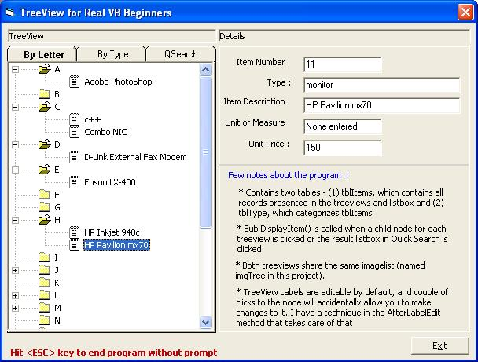



## TreeView, Traditional Search, and database \- for Real VB Beginners

### Description

This teaches how to use treeviews using databases (MS-Access). Uses ADO for connection. Also demonstrates small amount of SQL statements. All in one for real VB Beginners! This includes other treeview methods not discussed in other tutorials. Run the program to find out more! (this is just a part of an application that I am also about to upload). Dont forget to read the README.txt which is also in the zip file. tnx!
 
### More Info
 
* This is not a data-entry program.

             |
---                |---
**Submitted On**   |2002-06-08 01:27:40
**By**             |[delTex](https://github.com/Planet-Source-Code/PSCIndex/blob/master/ByAuthor/deltex.md)
**Level**          |Beginner
**User Rating**    |5.0 (45 globes from 9 users)
**Compatibility**  |VB 6\.0
**Category**       |[Miscellaneous](https://github.com/Planet-Source-Code/PSCIndex/blob/master/ByCategory/miscellaneous__1-1.md)
**World**          |[Visual Basic](https://github.com/Planet-Source-Code/PSCIndex/blob/master/ByWorld/visual-basic.md)
**Archive File**   |[TreeView,\_91718682002\.zip](https://github.com/Planet-Source-Code/deltex-treeview-traditional-search-and-database-for-real-vb-beginners__1-35601/archive/master.zip)

